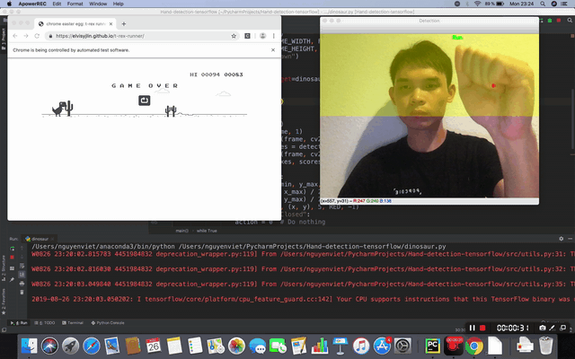

# [PYTHON] AirGesture - Play games without touching keyboard

## Introduction

Here is my python source code for AirGesture - Play games without touching keyboard. With my code, you could play many games on PC without using any keyboard. At the moment you could play the following games 
* **Super Mario Bros** by running the **script mario.py**
* **Battle City** by running the script **battle_city.py**
* **Dinosaur Game** by running the script **dinosaur.py**

Please make sure that only one hand shown in front of camera. Otherwise scripts may not work as well as you expect
## Super Mario Bros
The screen is splitted into 3 equal parts horizontally.
Here is the mapping between your gesture and Mario's movement:
- **Open hand within the left part** -> Left jump
- **Closed hand within the left part** -> Left run
- **Open hand within the middle part** -> Jump
- **Closed hand within the middle part** -> Do nothing
- **Open hand within the right part** -> Right jump
- **Closed hand within the right part** -> Right run

   
  <i>Super Mario Bros</i>

## Battle City
The screen is splitted into 5 parts, including 4 triangles and a circle.
Here is the mapping between your gesture and tank's movement:
- **Open hand** -> Fire
- **Closed hand within the circle** -> Do nothing
- **Closed hand within the left triangle** -> Go left
- **Closed hand within the right triangle** -> Go right
- **Closed hand within the up triangle** -> Go up
- **Closed hand within the left triangle** -> Go down

   
  <i>Battle City</i>

## Dinosaur Game
The screen is splitted into 2 equal parts vertically.
Here is the mapping between your gesture and dinosaur's action:
- **Closed hand** -> Run
- **Open hand within the upper part** -> Jump
- **Open hand within the lower part** -> Duck

   
  <i>Dinosaur</i>

## Requirements

* **python 3.x**
* **cv2**
* **tensorflow** 
* **numpy**
* **gym**
* **gym_super_mario_bros**
* **gym_chrome_dino**
* **pygame**
* **opencv**
